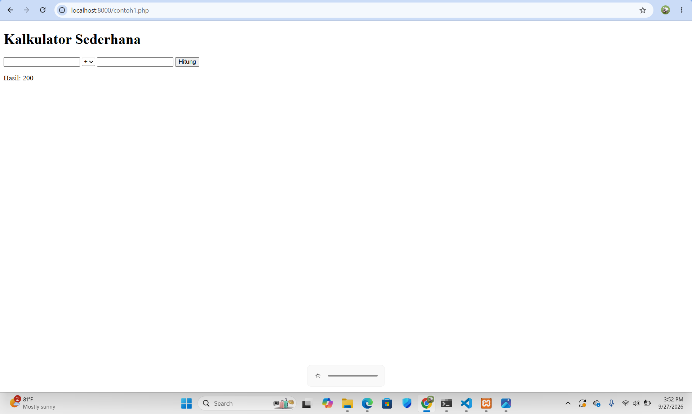
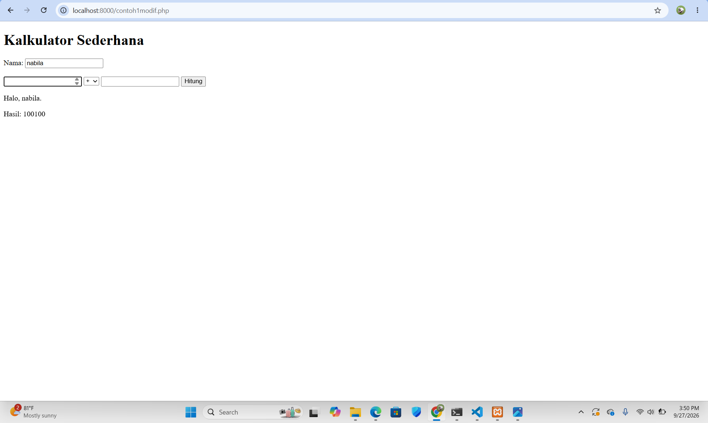
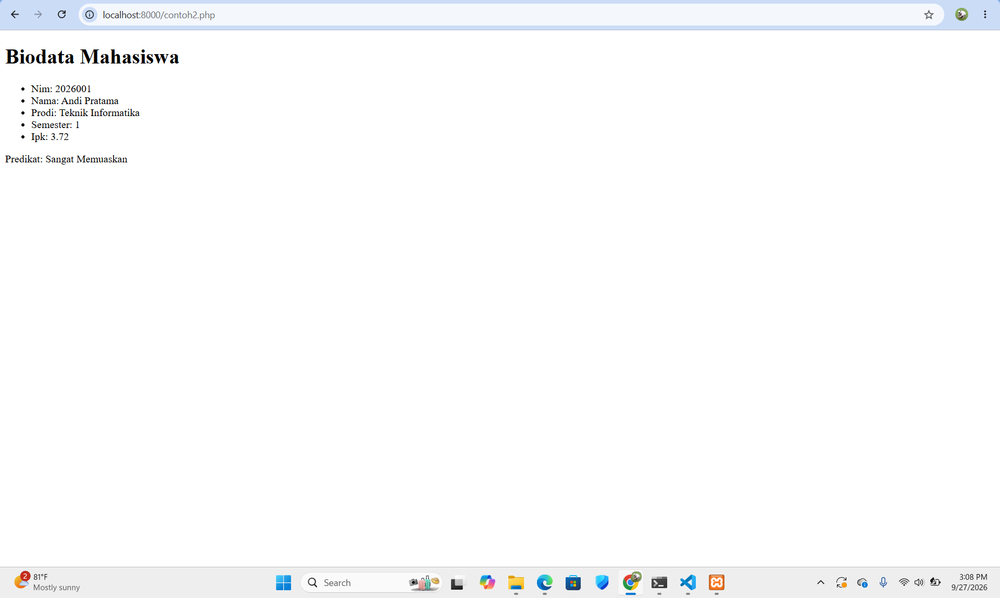
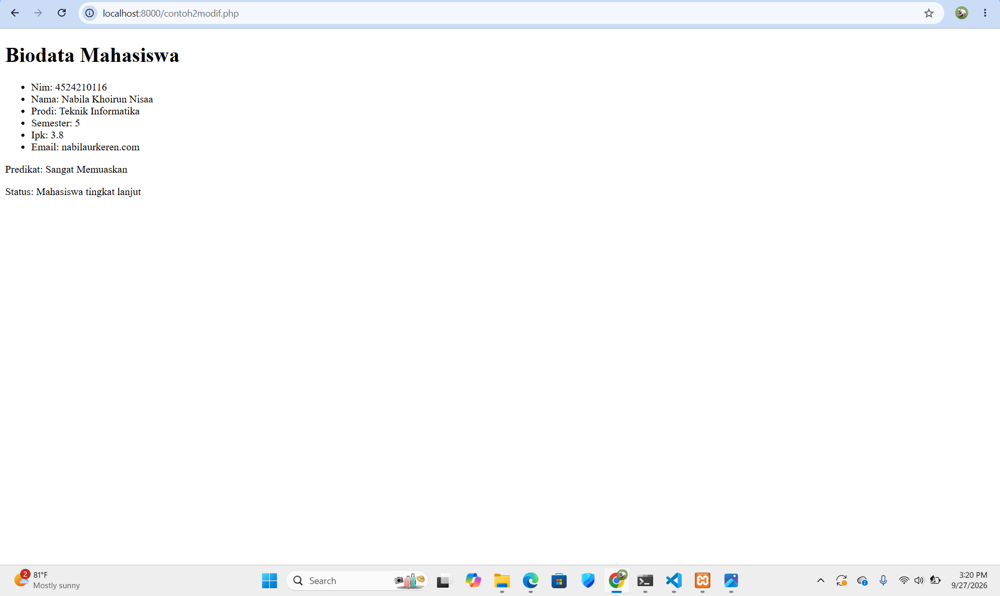

# Tugas 1 Praktikum PBW
*Nama:* Nabila Khoirun Nisaa'
*NPM:* 4524210116

## 1. Modifikasi Program Kalkulator

### Modifikasi 1
Menambahkan input nama pengguna dan menampilkan nama pada hasil perhitungan.

### Modifikasi 2
Menambahkan operator modulus (%) untuk menghitung sisa hasil pembagian.

### Modifikasi 3
Menambahkan styling sederhana agar tampilan kalkulator lebih rapi.

### Penjelasan 5 Bagian Kode Penting

1. **$_SERVER['REQUEST_METHOD']**  
   Digunakan untuk mengecek apakah form dikirim menggunakan metode POST.

2. **$_POST**  
   Digunakan untuk mengambil data angka dan operator dari form.

3. **switch**  
   Digunakan untuk menentukan operasi berdasarkan operator yang dipilih.

4. **Validasi pembagian dengan nol**  
   Digunakan untuk mencegah pembagian dengan angka nol.

5. **Operator modulus (%)**  
   Digunakan untuk menghitung sisa hasil pembagian.

### Screenshot Sebelum Modifikasi

### Screenshot Sesudah Modifikasi

---

## Modifikasi Program Biodata

### Modifikasi 1 - Menambahkan Field Email

Saya menambahkan field email pada data mahasiswa. Penambahan ini membuat biodata mahasiswa memiliki informasi tambahan selain NIM, nama, program studi, semester, dan IPK.

### Modifikasi 2 - Menambahkan Status Mahasiswa

Saya menambahkan kondisi berdasarkan semester untuk menentukan status mahasiswa. Jika semester mahasiswa 5 atau lebih, maka akan ditampilkan sebagai "Mahasiswa tingkat lanjut". Jika semester kurang dari 5, maka ditampilkan sebagai "Mahasiswa awal".

---

## Penjelasan 5 Bagian Kode Penting

### 1. Function `statusKelulusan()`

Function ini digunakan untuk menentukan predikat berdasarkan IPK mahasiswa. Jika IPK 3.50 atau lebih, maka predikatnya "Sangat Memuaskan". Jika IPK 3.00 atau lebih, maka predikatnya "Memuaskan". Selain itu, predikatnya "Perlu Peningkatan".

### 2. Array `$mahasiswa`

Array `$mahasiswa` digunakan untuk menyimpan data biodata mahasiswa seperti NIM, nama, program studi, semester, IPK, dan email.

### 3. `foreach`

`foreach` digunakan untuk mengambil setiap data yang ada di dalam array `$mahasiswa` dan menampilkannya satu per satu pada halaman web.

### 4. `htmlspecialchars()`

`htmlspecialchars()` digunakan agar karakter khusus pada data yang ditampilkan dapat diproses dengan aman sebagai HTML.

### 5. Kondisi Status Mahasiswa

Kondisi ini digunakan untuk menentukan status mahasiswa berdasarkan semester. Jika semester 5 atau lebih, maka ditampilkan sebagai "Mahasiswa tingkat lanjut". Jika kurang dari 5, maka ditampilkan sebagai "Mahasiswa awal".

---

## Screenshot Sebelum Modifikasi

## Screenshot Sesudah Modifikasi

---

## Error yang Pernah Muncul

### Error

`The requested resource /contoh2.php was not found on this server.`

### Penyebab

File `contoh2.php` tidak ditemukan pada folder yang sedang dijalankan oleh PHP server.

### Langkah Perbaikan

Saya mengecek kembali nama dan lokasi file pada folder `pertemuan1`. Setelah itu, saya membuka file PHP yang benar melalui URL localhost sesuai dengan nama file yang tersedia.
