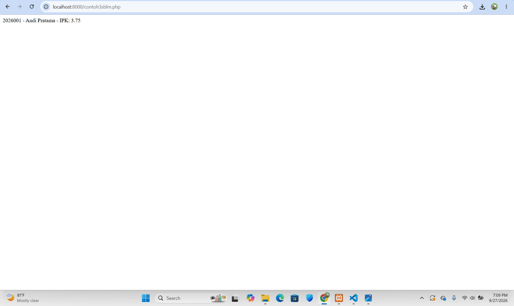
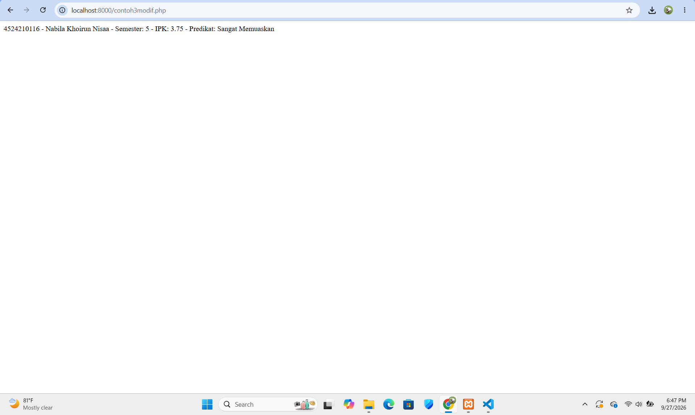
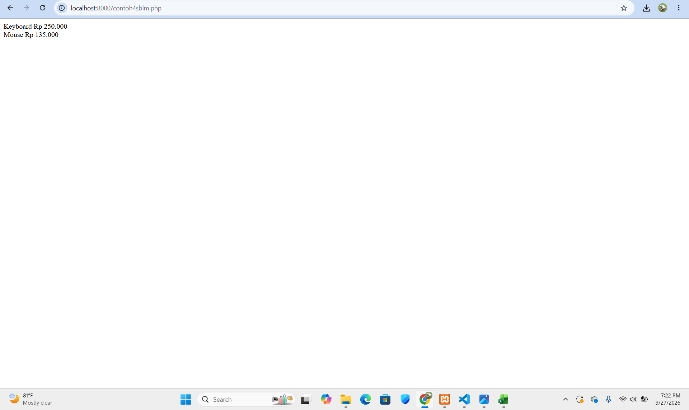
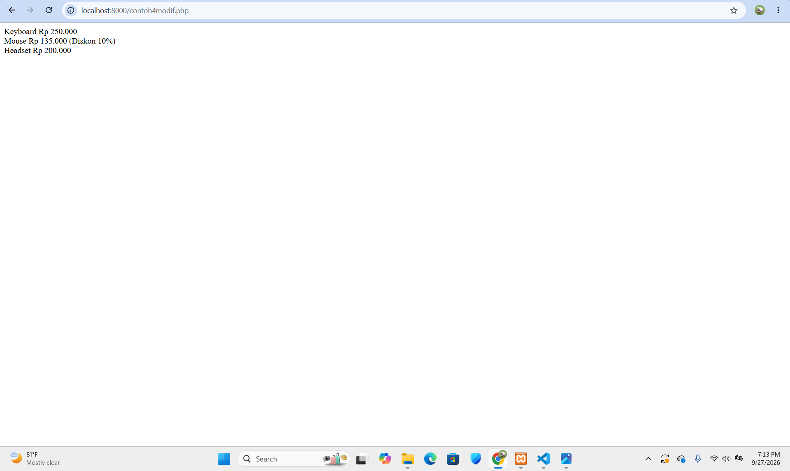

# Tugas 1 Praktikum PBW

## 1. Modifikasi Program Identitas Mahasiswa

### Modifikasi 1 - Menambahkan Semester

Saya menambahkan atribut `semester` pada class `Mahasiswa`. Data semester digunakan untuk menampilkan informasi semester mahasiswa pada hasil ringkasan.

### Modifikasi 2 - Menambahkan Predikat Berdasarkan IPK

Saya menambahkan function `getPredikat()` untuk menentukan predikat mahasiswa berdasarkan nilai IPK. Jika IPK 3.50 atau lebih, maka predikatnya "Sangat Memuaskan". Jika IPK 3.00 atau lebih, maka predikatnya "Memuaskan". Selain itu, predikatnya "Perlu Peningkatan".

---

## Penjelasan 5 Bagian Kode Penting

### 1. Interface `Identitas`

Interface `Identitas` digunakan sebagai aturan yang mewajibkan class `Mahasiswa` memiliki function `ringkasan()`.

### 2. Class `Mahasiswa`

Class `Mahasiswa` digunakan untuk menyimpan dan mengelola data mahasiswa seperti NIM, nama, semester, dan IPK.

### 3. Function `setIpk()`

Function `setIpk()` digunakan untuk memberikan nilai IPK sekaligus melakukan validasi agar nilai IPK berada pada rentang 0 sampai 4.

### 4. Function `getPredikat()`

Function `getPredikat()` digunakan untuk menentukan predikat mahasiswa berdasarkan nilai IPK.

### 5. Function `ringkasan()`

Function `ringkasan()` digunakan untuk menggabungkan dan menampilkan data NIM, nama, semester, IPK, dan predikat mahasiswa dalam bentuk teks.

---

## Screenshot Sebelum Modifikasi

## Screenshot Sesudah Modifikasi

---

## 2. Modifikasi Program Perhitungan Produk

### Modifikasi 1 - Menambahkan Function `getDiskon()`

Saya menambahkan function `getDiskon()` pada class `ProdukDiskon` untuk mengambil nilai diskon dari produk.

### Modifikasi 2 - Menambahkan Produk Baru

Saya menambahkan produk `Headset` dengan harga Rp200.000 ke dalam daftar produk.

---

## Penjelasan 5 Bagian Kode Penting

### 1. Interface `BisaDihitung`

Interface `BisaDihitung` digunakan sebagai aturan agar class yang menggunakannya memiliki function `hargaAkhir()`.

### 2. Class `Produk`

Class `Produk` digunakan untuk menyimpan nama dan harga produk serta menghitung harga akhirnya.

### 3. Class `ProdukDiskon`

Class `ProdukDiskon` merupakan turunan dari class `Produk`. Class ini digunakan untuk menghitung harga produk setelah mendapatkan diskon.

### 4. Function `hargaAkhir()`

Function `hargaAkhir()` digunakan untuk menentukan harga akhir produk. Pada `ProdukDiskon`, function ini menghitung harga setelah dikurangi diskon.

### 5. `foreach`

`foreach` digunakan untuk mengambil setiap produk yang ada di dalam array `$daftar` dan menampilkan nama serta harga akhirnya.

---

## Screenshot Sebelum Modifikasi

## Screenshot Sesudah Modifikasi

---
## Error yang Pernah Muncul

### Error

Gambar screenshot tidak muncul di README dan hanya tampil sebagai link atau teks.

### Penyebab

Format penulisan gambar pada README belum sesuai dan path folder gambar yang ditulis tidak sama dengan nama folder sebenarnya.

### Langkah Perbaikan

Saya memperbaiki format Markdown dengan menggunakan tanda `!` sebelum tanda kurung siku dan menyesuaikan path gambar dengan nama folder `screenshot`.

Contoh format yang benar:

