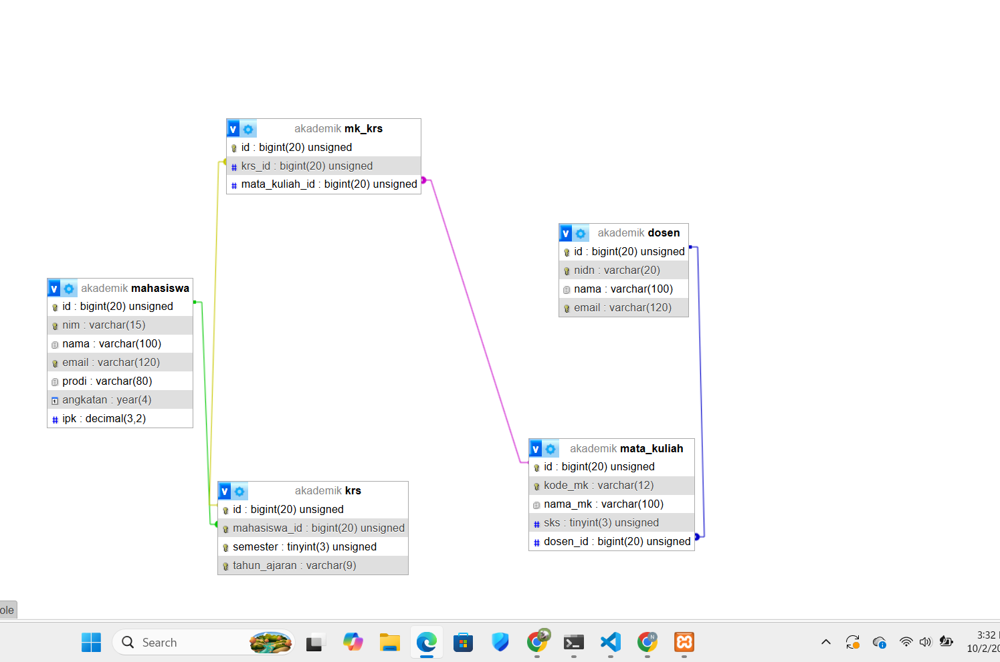
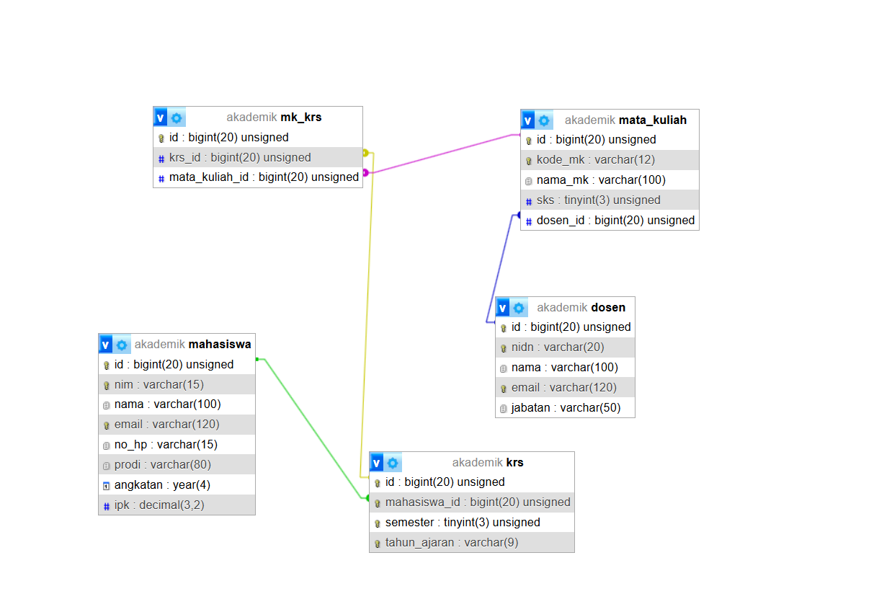

# Tugas 3 Praktikum MySQL Dasar

**Nama:** Nabila Khoirun Nisaa'  

**NPM:** 4524210116

## Modifikasi Database Akademik

### Modifikasi 1 - Menambahkan Nomor HP Mahasiswa

Saya menambahkan kolom `no_hp` pada tabel `mahasiswa` untuk menyimpan nomor HP mahasiswa. Kolom ini menggunakan tipe data `VARCHAR(15)` dan dibuat `NOT NULL` agar setiap data mahasiswa memiliki nomor HP.

### Modifikasi 2 - Menambahkan Jabatan Dosen

Saya menambahkan kolom `jabatan` pada tabel `dosen` untuk menyimpan jabatan yang dimiliki oleh dosen. Kolom ini menggunakan tipe data `VARCHAR(50)` dan dibuat `NOT NULL`.

---

## Penjelasan 5 Bagian Kode Penting

### 1. `require_once 'koneksi.php'`

Kode ini digunakan untuk menghubungkan program dengan database MySQL melalui file `koneksi.php`. Dengan menggunakan `require_once`, file koneksi hanya akan dimuat satu kali.

### 2. `CREATE DATABASE IF NOT EXISTS`

Query ini digunakan untuk membuat database dengan nama `akademik`. Penggunaan `IF NOT EXISTS` membuat database tidak dibuat ulang jika database tersebut sudah tersedia.

### 3. `mysqli_set_charset()`

Function `mysqli_set_charset()` digunakan untuk mengatur karakter yang digunakan oleh koneksi database menjadi `utf8mb4`. Hal ini membantu agar database dapat menyimpan berbagai karakter dengan baik.

### 4. Query `CREATE TABLE`

Bagian ini digunakan untuk membuat tabel-tabel yang dibutuhkan dalam database akademik, seperti `mahasiswa`, `dosen`, `mata_kuliah`, `krs`, dan `mk_krs`.

Pada modifikasi ini, tabel `mahasiswa` ditambahkan kolom `no_hp`, sedangkan tabel `dosen` ditambahkan kolom `jabatan`.

### 5. `foreach`

`foreach` digunakan untuk menjalankan semua query pembuatan tabel yang terdapat di dalam array `$sqlCreateTables`. Setiap query dijalankan menggunakan `mysqli_query()` dan akan menampilkan pesan berhasil atau error.

---

## Screenshot Sebelum Modifikasi

## Screenshot Sesudah Modifikasi

---

## Error yang Pernah Muncul

### Error

Error dapat muncul ketika program tidak dapat terhubung atau menjalankan query pada database MySQL.

### Penyebab

Penyebabnya dapat berasal dari koneksi database yang belum benar atau query yang dijalankan mengalami kesalahan.

### Langkah Perbaikan

Saya memeriksa kembali file `koneksi.php`, nama database, serta query yang digunakan untuk membuat tabel. Setelah koneksi dan query diperbaiki, program dapat dijalankan kembali tanpa error kritis.