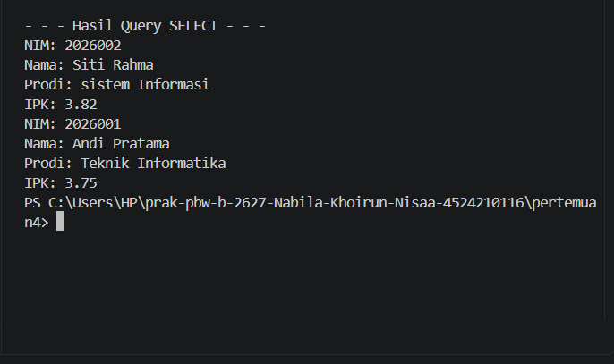
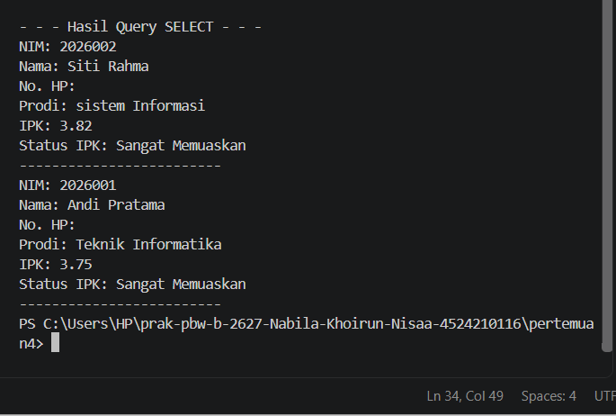
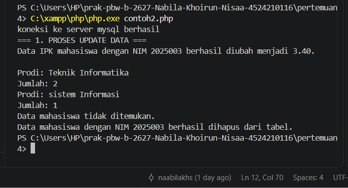
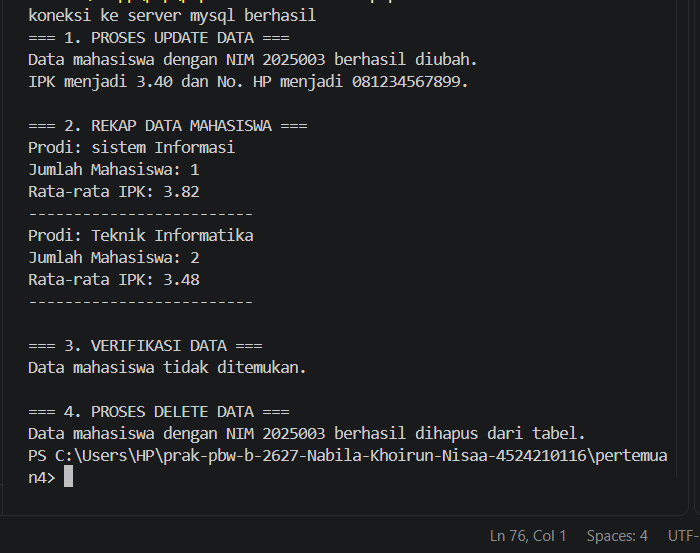

# Tugas 4 Praktikum PBW

**Nama:** Nabila Khoirun Nisaa'  

**NPM:** 4524210116

## 1. Tugas Contoh 1

### Modifikasi 1

Menambahkan field `no_hp` pada proses INSERT untuk menyimpan nomor HP mahasiswa. Data nomor HP juga ditampilkan pada hasil SELECT.

### Modifikasi 2

Menambahkan status berdasarkan IPK pada proses SELECT menggunakan `CASE`. Jika IPK 3.75 atau lebih, maka status yang ditampilkan adalah "Sangat Memuaskan", sedangkan IPK di bawah 3.75 mendapatkan status "Memuaskan".

### Penjelasan 5 Bagian Kode Penting

1. **Koneksi dan Pemilihan Database**

   Digunakan untuk menghubungkan program dengan database dan memilih database `akademik`.

   `require_once 'koneksi.php';`

   `mysqli_select_db($koneksi, 'akademik');`

2. **Proses INSERT dengan mysqli_query()**

   Digunakan untuk memasukkan data mahasiswa ke dalam tabel `mahasiswa`. Pada modifikasi ini, field `no_hp` juga ditambahkan.

   `if (mysqli_query($koneksi, $sqlInsert)) {`

   `echo "[INSERT] Data mahasiswa berhasil dimasukan ke tabel.\n\n";`

   `}`

3. **Query SELECT dengan CASE**

   Digunakan untuk mengambil data mahasiswa sekaligus menentukan status berdasarkan nilai IPK.

   `CASE`

   `WHEN ipk >= 3.75 THEN 'Sangat Memuaskan'`

   `ELSE 'Memuaskan'`

   `END AS status_ipk`

4. **Perulangan while dan mysqli_fetch_assoc()**

   Digunakan untuk mengambil dan menampilkan data mahasiswa satu per satu dari hasil query.

   `while ($row = mysqli_fetch_assoc($RESULT)) {`

   `echo "NIM: " . $row['nim'] . "\n";`

   `echo "Nama: " . $row['nama'] . "\n";`

   `}`

5. **Menampilkan No. HP dan Status IPK**

   Digunakan untuk menampilkan informasi tambahan dari hasil query SELECT.

   `echo "No. HP: " . $row['no_hp'] . "\n";`

   `echo "IPK: " . $row['ipk'] . "\n";`

   `echo "Status IPK: " . $row['status_ipk'] . "\n";`

### Screenshot Sebelum Modifikasi

### Screenshot Sesudah Modifikasi

## 2. Tugas contoh 2

### Modifikasi 1

Menambahkan perubahan `no_hp` pada proses UPDATE sehingga proses UPDATE tidak hanya mengubah IPK, tetapi juga nomor HP mahasiswa.

### Modifikasi 2

Menambahkan perhitungan rata-rata IPK pada proses GROUP BY menggunakan `AVG(ipk)`. Dengan demikian, rekap data menampilkan jumlah mahasiswa dan rata-rata IPK berdasarkan program studi.

### Penjelasan 5 Bagian Kode Penting

1. **Proses UPDATE dengan mysqli_query()**

   Digunakan untuk mengubah data IPK dan nomor HP mahasiswa dengan NIM `2025003`.

   `$sqlUpdate = "UPDATE mahasiswa SET ipk = 3.40, no_hp = '081234567899' WHERE nim = '2025003'";`

   `if (mysqli_query($koneksi, $sqlUpdate)) {`

   `echo "Data mahasiswa dengan NIM 2025003 berhasil diubah.\n";`

   `}`

2. **GROUP BY dan COUNT()**

   Digunakan untuk mengelompokkan mahasiswa berdasarkan prodi dan menghitung jumlah mahasiswa pada setiap prodi.

   `SELECT prodi,`

   `COUNT(*) AS jumlah_mahasiswa`

   `FROM mahasiswa`

   `GROUP BY prodi`

3. **AVG() untuk Menghitung Rata-rata IPK**

   Digunakan untuk menghitung nilai rata-rata IPK mahasiswa pada setiap prodi.

   `AVG(ipk) AS rata_rata_ipk`

   Hasil rata-rata IPK kemudian ditampilkan menggunakan `number_format()` agar tampil dengan dua angka di belakang koma.

4. **Pengecekan Data Sebelum DELETE**

   Digunakan untuk mengecek apakah data mahasiswa dengan NIM `2025003` tersedia sebelum dilakukan penghapusan.

   `if (mysqli_num_rows($resultVerifikasi) > 0) {`

   `$row = mysqli_fetch_assoc($resultVerifikasi);`

   `echo "Data ditemukan:\n";`

   `}`

5. **Proses DELETE dengan mysqli_query()**

   Digunakan untuk menghapus data mahasiswa berdasarkan NIM setelah data tersebut diverifikasi.

   `$sqlDelete = "DELETE FROM mahasiswa WHERE nim = '2025003'";`

   `if (mysqli_query($koneksi, $sqlDelete)) {`

   `echo "Data mahasiswa dengan NIM 2025003 berhasil dihapus dari tabel.\n";`

   `}`

### Screenshot Sebelum Modifikasi

### Screenshot Sesudah Modifikasi

## 3. Error yang Pernah Muncul

### Error

`Could not open input file: contoh2modif.php`

### Penyebab

Error terjadi karena nama file yang ditulis pada perintah terminal tidak sesuai dengan nama file yang ada di folder. Nama file yang sebenarnya adalah `contoh2.modif.php`, bukan `contoh2modif.php`.

### Langkah Perbaikan

Saya mengecek kembali nama file yang terdapat pada folder `pertemuan4`. Setelah diketahui nama file yang benar adalah `contoh2.modif.php`, saya menjalankan program menggunakan perintah:

`C:\xampp\php\php.exe contoh2.modif.php`

Setelah nama file disesuaikan, program dapat dijalankan melalui terminal.